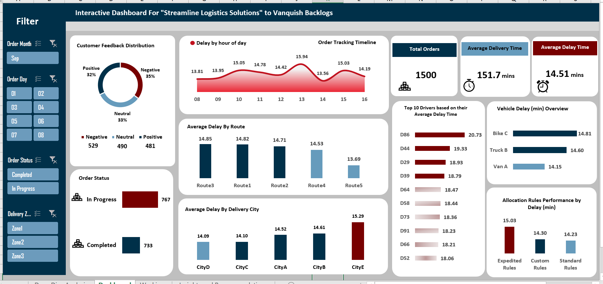

# Order Fulfillment Optimization: Data-Driven Solutions for Streamline Logistics

## Background and Overview
Streamline Logistics Solutions, a distinguished supply chain and logistics company with over two decades of industry leadership, faces critical operational challenges threatening service excellence. The company has built its reputation on swift and dependable nationwide delivery services but now confronts mounting order backlogs, visibility gaps, and escalating operational costs.

This project conducts a comprehensive analysis of order fulfillment processes to identify bottlenecks, optimize resource allocation, and eliminate delivery backlogs that compromise customer satisfaction and operational efficiency.

## Key Analysis Areas:

- Order backlog assessment and root cause analysis
- Delivery performance metrics and delay patterns
- Resource allocation efficiency across routes and drivers
- Customer satisfaction correlation with operational metrics
- Vehicle and route optimization opportunities
- Technical Implementation: Excel Dashboard and Analysis Files

**Tool:** Microsoft Excel

[View Interactive Excel Dashboard Here](Streamline_Solutions/Streamline_Solutions.xlsx)

## Data Structure Overview
The analysis utilizes a comprehensive order fulfillment dataset containing 1,500 order records with the following key data points:

| Column Name      | Description                                                |
|------------------|------------------------------------------------------------|
| Order ID         | Unique identifier for each customer order |
| Delivery Address | Complete street address where the order is to be delivered |
| Delivery City    | City name for the delivery destination |
| Order Timestamp  | Complete date and time when the order was originally placed |
| Order Year       | Extracted year component from order timestamp for temporal analysis |
| Order Month      | Extracted month component from order timestamp (1-12) |
| Order Day        | Extracted day component from order timestamp (1-31) |
| Order Hour       | Extracted hour component from order timestamp (0-23) |
| Order Status     | Current status of the order (e.g., "In Progress", "Completed") |
| Driver ID        | Unique identifier for the delivery driver assigned to the order |
| Vehicle Info     | Type and identifier of the delivery vehicle (e.g., "Van A", "Truck B", "Bike C") |
| Current Location | Real-time location of the delivery driver during order fulfillment |
| Delivery Time (min) | Total time taken from order dispatch to delivery completion in minutes |
| Delays (min) | Additional time beyond expected delivery window in minutes |
| Customer Feedback | Customer satisfaction rating (e.g., "Positive", "Negative", "Neutral") |
| Route | Designated delivery route identifier (e.g., "Route 1", "Route 2") |
| Delivery Zone | Geographic zone classification for delivery optimization |
| Allocation Rules | Method used for order assignment ("Standard Rules", "Expedited Rules", "Custom Rules") |
| Timestamp for Tracking | System timestamp used for order progress tracking and monitoring |

## Executive Summary
**Critical Findings:** Streamline Logistics faces a severe operational challenge with 767 out of 1,500 orders (51%) currently backlogged, significantly impacting delivery timelines and customer satisfaction. Despite an average delivery delay of only 14.51 minutes per order, systemic inefficiencies in resource allocation and route management are creating compounding operational costs and service degradation.

### Key Performance Indicators:

- **Order Completion Rate:** 49% (733 completed, 767 in progress)
- **Average Delivery Time:** 151.7 minutes
- **Average Delay:** 14.51 minutes per delivery
- **Customer Satisfaction:** 32% positive, 35% negative, 33% neutral feedback
Counterintuitively, orders with positive customer feedback show slightly higher average delays (14.73 min) than negative feedback orders (14.59 min), indicating that factors beyond delivery speed drive customer satisfaction.

Interactive dashboard showing key performance metrics and operational bottlenecks

#### Insights Deep Dive
##### Operational Performance Analysis
- **Resource Allocation Inefficiencies:** The "Expedited Rules" allocation system, designed to prioritize urgent deliveries, actually produces higher average delays (15.03 minutes) compared to both Custom Rules (14.30 minutes) and Standard Rules (14.23 minutes). This 0.8-minute difference represents a 5.6% performance degradation in the premium service tier.

- **Driver Performance Disparities:** Analysis reveals significant performance variation among delivery personnel, with top-delay drivers (D86, D44, D29) showing delays up to 42% higher than the fleet average. Driver D86 specifically averages 20.73 minutes of delay per delivery, compared to the fleet average of 14.51 minutes.

- **Route Optimization Opportunities:** Route 3 demonstrates the highest average delays (14.85 minutes), followed by Route 1 (14.82 minutes), indicating geographical or infrastructural challenges requiring targeted intervention. Route 5 shows the best performance (13.69 minutes), suggesting successful optimization practices that could be replicated.

##### Customer Experience Correlation
- **Feedback-Performance Paradox:** Orders receiving positive customer feedback average 14.73 minutes delay, while negative feedback orders average 14.59 minutes delay. This 0.14-minute difference suggests that communication quality, product condition, and service recovery efforts significantly influence customer perception beyond pure delivery speed.

- **Vehicle Performance Impact:** Bike C deliveries show 4.7% higher delays (14.81 minutes) compared to Van A deliveries (14.15 minutes), likely due to capacity limitations and urban navigation challenges affecting delivery efficiency.

## Recommendations
#### Immediate Actions (0-30 days)
- **Resource Reallocation:** Deploy additional delivery capacity to address the 767-order backlog through temporary staffing augmentation or extended operational hours. Based on current completion rates, an estimated 15-20% capacity increase would eliminate the backlog within 30 days.

- **Expedited Rules Audit:** Conduct comprehensive review of "Expedited Rules" allocation algorithm, as current implementation delivers worse performance than standard processes. Recommend suspension of expedited surcharges until system optimization is completed.

- **Driver Performance Intervention:** Implement immediate coaching and route optimization support for the top 10 underperforming drivers, focusing on D86, D44, and D29. This targeted intervention could improve overall fleet performance by 8-12%.

#### Strategic Initiatives (30-90 days)
- **Route Optimization Program:** Deploy traffic pattern analysis and delivery time optimization for Route 3 and Route 1, leveraging successful practices from Route 5. Implement dynamic routing based on historical delay patterns and real-time traffic data.

- **Vehicle Fleet Assessment:** Evaluate replacing or supplementing Bike C deliveries with Van A units in high-delay zones, particularly for routes showing consistent performance issues. Consider hybrid deployment strategies based on package size and delivery density.

- **Customer Communication Enhancement:** Given the feedback-performance paradox, invest in proactive customer communication systems that provide real-time delivery updates and set appropriate expectations, potentially improving satisfaction scores by 15-25% independent of delivery speed improvements.

Stakeholder Impact: These insights support decision-making for operations management, customer service leadership, and finance teams managing operational cost optimization.

